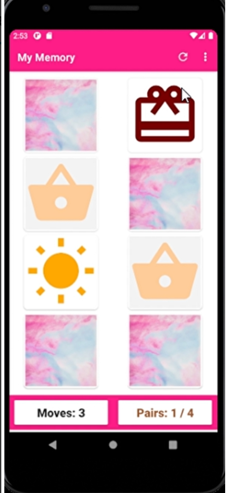

# _Remember: A memory game in kotlin_
## Inspiration
**_The theme of the hackathon is sports, a sport is anything that challenges you and makes you do better, that was the reason, I decided to build an android application which is  game in Kotlin. It is a memory game which is fully customizable. You can test your memory by flipping cards and matching them. The difficulty level can be increased as per choice._**

## What it does :running:
* Play the traditional memory game.
* Three difficulty levels with 3 grid sizes, easy, medium and hard with 4 x 2, 6 x 3 and 6 x 4 respectively.
* Restart and Refresh your game.
* Move counts and pair matched count maintained as per difficulty level.
* You win the game if all pairs are matched correctly 

## How I built it :smile:
The app was built fully in Kotlin, using android studio.

## Challenges I ran into 
Before the hackathon, I knew little about Kotlin, it was an opportunity for me to learn a language and a technology entirely from scratch while building something. I encountered, several errors and browsed the internet to solve them. Setting up the emulator was also a challenge.

## Accomplishments that I'm proud of :heart:
I was able to build something small yet useful in a little amount of time, this is the first time I have made a game.

## What I learned :books:
* Kotlin
* Android and Kotlin
* Recyclerview
* Using vector icons

## What's next for Remember: A memory game
* The user can play the game using custom images.
* More interactivity can be added.
* Background music can be added.
* Work on the UI.

## Demo :star:
**_youtube_** : https://youtu.be/ATToJ4n11zs

